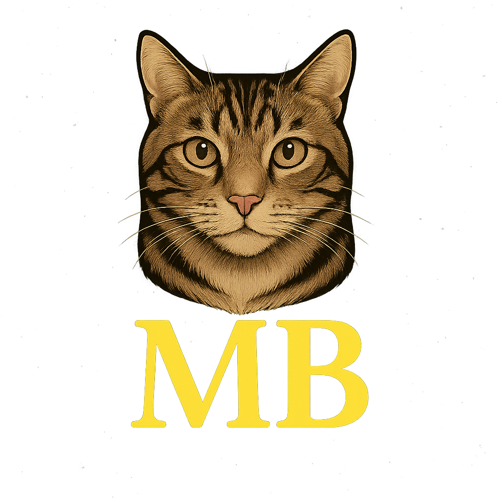
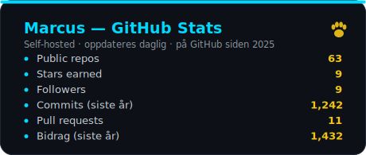
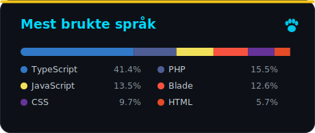

<!-- ════════════════════════════════════════════════════════════════════════ -->
<!--  Marcus Børresen · MoBo Digital · GitHub Profile                          -->
<!--  Tema: dark · cyan (#00D9FF) · gull (#F5C518, fra MB-logoen)              -->
<!-- ════════════════════════════════════════════════════════════════════════ -->

<div align="center">



<!-- Animert header -->
<a href="https://github.com/Marcus-Kodehode">
  
</a>

<!-- Social -->
<p>
  <a href="mailto:marcusboerresen@gmail.com">
    
  </a>
  <a href="https://www.linkedin.com/in/marcus-borresen">
    
  </a>
  <a href="https://vercel.com/marcus-boerresens-projects">
    
  </a>
  
</p>

</div>


## 👋 Om meg

<table>
<tr>
<td width="62%" valign="top">

Jeg er **Marcus Børresen**, en full-stack-utvikler fra **Sande, Vestfold** 📍.
Etter å ha fullført utviklerutdanningen på **Kodehode** jobber jeg nå som
**Full-Stack Developer hos Skjld Labs**, og bygger **Aurnor** — et AI-drevet
porteføljeanalyseverktøy — på si.

Jeg trives best der **gjennomtenkt frontend møter solid backend**: rene
arkitekturer, ekte forretningslogikk og produkter som faktisk er i produksjon.
Jeg bygger gjerne hele veien fra database og API til et grensesnitt som er godt
å bruke.

```typescript
const marcus = {
  role: "Full-Stack Developer",
  company: "Skjld Labs",
  building: "Aurnor — AI portfolio analysis 📈",
  stack: ["Laravel", "Next.js", "TypeScript", "PHP", "MongoDB", "PostgreSQL"],
  focus: ["Clean architecture", "Real business logic", "Shipping to prod"],
  philosophy: "Skriv kode som leser seg selv — og send den ut i verden.",
};
```

🌍 **Snakker:** Norsk &nbsp;·&nbsp; English
&nbsp;|&nbsp; ☕ **Drivstoff:** Kaffe
&nbsp;|&nbsp; 🧙 **Hjem:** Midgard / Tolkien-nerd

</td>
<td width="38%" valign="top" align="center">

<br/>


<br/>

<br/>

<br/>


<br/><br/>

> 💭 *"I deliver production-ready, high-performance applications with a focus on clean code, accessibility and user-centric design."*

</td>
</tr>
</table>


## 🛠️ Tech Stack

<div align="center">

**Frontend**

       

**Styling & UI**

    

**Backend**

      

**Database**

    

**Verktøy & Plattform**

       

</div>


## 🚀 Utvalgte prosjekter

> En kuratert liste — kun de prosjektene jeg står inne for. Hver lenke er live og verifisert.

### 🪙 Aurnor — AI-drevet porteføljeanalyse · *flaggskip*

<table>
<tr>
<td valign="top">

**Din personlige stab av aksjeanalytikere.** Aurnor er et SaaS-verktøy for private
investorer: opprett porteføljer, følg markedsdata i sanntid og kjør analyser via
fem AI-agenter som vurderer aksjer fra ulike perspektiv (teknisk, makro, bear m.fl.).
Bygget med fokus på sikkerhet, abonnementslogikk og WCAG 2.1 AA.

   

[](https://aurnor-main-p6rlgb.laravel.cloud/) 

</td>
</tr>
</table>

<table>
<tr>

<td width="50%" valign="top">

#### 💄 Make Up by Michael
**Portefølje- og bookingside** for makeup-artist Michael Douglas. Editorial-inspirert,
skandinavisk design bygget for elegant førsteinntrykk og sterk SEO i Norge.

  

[](https://make-up-by-michael.vercel.app) 

</td>

<td width="50%" valign="top">

#### 🤿 Drammen Sportsdykkere
Moderne **klubbnettside** med medlemsportal, artikler med planlagt publisering,
kontaktskjema (Resend) og Vipps/Grasrotandelen-støtte.

  

[](https://drammen-sportsdykkere-v2.vercel.app) 

</td>

</tr>
<tr>

<td width="50%" valign="top">

#### 📅 Schedulo
Multi-tenant **SaaS-bookingplattform** for salonger, hytteutleie og tjeneste­bedrifter.
Komplett tenant-isolasjon, ressursstyring, abonnementsnivåer og unike booking-URL-er.

  

[](https://schedulo.vercel.app) [](https://github.com/Marcus-Kodehode/ReadySOFT-Project)

</td>

<td width="50%" valign="top">

#### 🎬 Buster Block
Full-stack **filmanmeldelsesplattform** — vurder, anmeld og oppdag film. Full CRUD,
stjernerating og sikker innlogging via Clerk.

  

[](https://buster-block.vercel.app) [](https://github.com/Marcus-Kodehode/Buster-Block)

</td>

</tr>
<tr>

<td width="50%" valign="top">

#### 🎁 Match-A-Gift
Intelligent **gavehjelper** som guider deg til riktig gave etter anledning. Bygget i
Angular med stemningsfullt glass-morphism-design.

  

[](https://match-a-gift.vercel.app) [](https://github.com/Marcus-Kodehode/match-a-gift)

</td>

<td width="50%" valign="top">

#### 📂 Mer
Flere prosjekter, eksperimenter og lærings­repoer ligger på profilen.

<br/>

[](https://github.com/Marcus-Kodehode?tab=repositories)

</td>

</tr>
</table>


## 📊 GitHub-statistikk

<div align="center">

<!-- Self-hosted (genereres av .github/workflows/stats.yml) — aldri nede, aldri rate-limited -->



<br/>


<br/>


<sub>📈 Statistikk-kortene (cyan/gull) er <strong>self-hosted</strong> — generert av en GitHub Action og committet til repoet, så de aldri går ned.</sub>

</div>


## 📬 La oss ta en prat

<div align="center">

Jeg er alltid åpen for spennende prosjekter, samarbeid og en god kodeprat.

```javascript
if (you.hasInterestingProject || you.wantToCollaborate) {
  marcus.contact({
    email: "marcusboerresen@gmail.com",
    linkedin: "marcus-borresen",
    responseTime: "< 24 timer",
    specialties: ["Full-Stack", "Laravel", "Next.js", "Product engineering"],
  });
}
```

<a href="mailto:marcusboerresen@gmail.com">
  
</a>
<a href="https://www.linkedin.com/in/marcus-borresen">
  
</a>

</div>

<br/>

<!-- ── Footer ─────────────────────────────────────────────────────────── -->
<div align="center">


<br/>

> **"One bug to find them, one fix to bring them all, and in the darkness bind them."**
> — *Marcus Børresen*

<sub>🐱 MoBo-logoen bærer ansiktet til <strong>Siam</strong> — 19 år med den beste vennen. Til minne. 🐾</sub>

</div>
