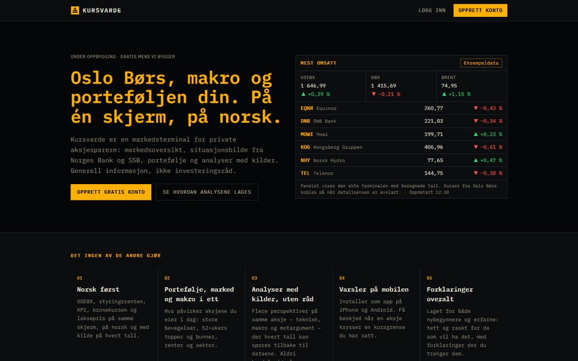
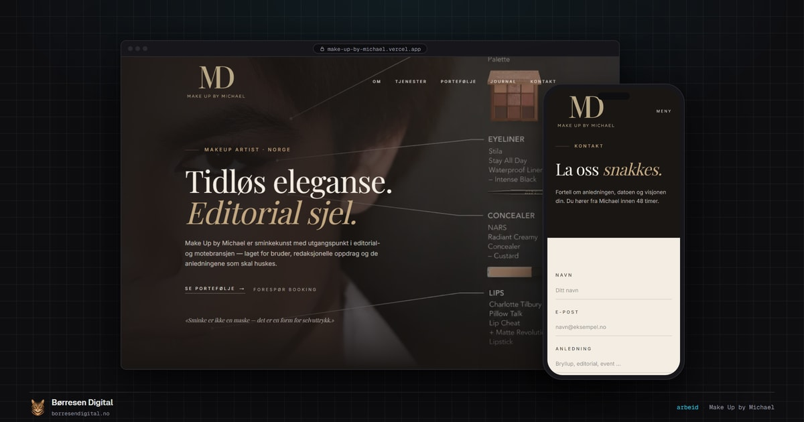
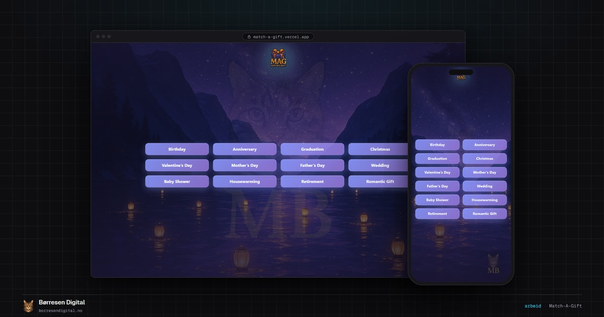
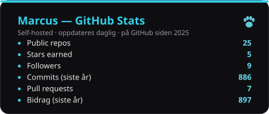
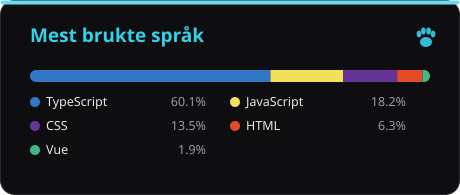
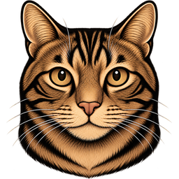

<!-- Profil for Marcus Børresen · Børresen Digital. Samme uttrykk som borresendigital.no: «Blueprint + Terminal», instrument-cyan, Geist. Headeren lages av scripts/generate-header.mjs, statistikken av scripts/generate-stats.mjs (daglig via .github/workflows/stats.yml), og case-bildene med case-skjermbilder-skillen. -->

<div align="center">

<a href="https://www.borresendigital.no">
  <picture>
    <source media="(prefers-color-scheme: light)" srcset="assets/header-light.svg">
    
  </picture>
</a>

<a href="https://www.borresendigital.no"></a> <a href="mailto:kontakt@borresendigital.no"></a> <a href="https://www.linkedin.com/in/marcus-b%C3%B8rresen-353870275/"></a> <a href="https://www.borresendigital.no/nb/avtal-samtale"></a>

</div>

## `$ cat om-meg.md`

Jeg er **Marcus**, full-stack-utvikler fra Sande i Vestfold. Jeg driver **[Børresen Digital](https://www.borresendigital.no)**, et enkeltpersonforetak som lager nettsider, bookingsystemer og webapplikasjoner for små bedrifter og foreninger, og som drifter dem etterpå.

Jeg liker best å eie hele veien: datamodellen, API-et, grensesnittet, testene, deployen og overvåkingen etterpå. Min egen nettside er også et alt-i-ett-system for foretaket, med CMS, CRM, tilbud, regnskap etter bokføringsloven og egen driftsovervåking, bygget på Cloudflare Workers.

```ts
const marcus = {
  bor: "Sande, Vestfold",
  driver: "Børresen Digital (ENK, 2026)",
  bygger: ["nettsider", "bookingsystemer", "webapper", "drift"],
  liker: ["ren arkitektur", "tester som fanger ting", "universell utforming"],
  utdannet: "Kodehode",
  drivstoff: "kaffe",
};
```

## `$ ls stack/`

<div align="center">

**Frontend**<br/>


**Backend og data**<br/>


**Plattform og verktøy**<br/>


<sub>Også: Cloudflare Workers, D1 og R2 · Drizzle · OpenNext · next-intl · Velite · Zod · Playwright · Lighthouse CI · Resend · Turnstile · Neon · MCP</sub>

</div>

## `$ ls arbeid/`

Casene med problem, løsning og resultat ligger på [borresendigital.no/arbeid](https://www.borresendigital.no/nb/arbeid).

<table>
<tr>
<td width="55%"><a href="https://www.borresendigital.no/nb/arbeid/kursvarde"></a></td>
<td width="45%" valign="middle"><b><a href="https://www.borresendigital.no/nb/arbeid/kursvarde">Kursvarde</a></b> · <i>under arbeid</i><br/><br/>Markedsterminal for private aksjesparere, bygget som egen tjeneste: Oslo Børs, makro fra Norges Bank og SSB, portefølje og AI-analyser med kilder. Informasjon, ikke rådgivning. Live på <a href="https://kursvarde.no">kursvarde.no</a>.<br/><br/><sub>Next.js · Cloudflare Workers · Neon · Drizzle · Clerk · Claude API</sub></td>
</tr>
<tr>
<td width="55%"><a href="https://www.borresendigital.no/nb/arbeid/make-up-by-michael"></a></td>
<td width="45%" valign="middle"><b><a href="https://www.borresendigital.no/nb/arbeid/make-up-by-michael">Make Up by Michael</a></b><br/><br/>Portefølje- og forespørselsside for en makeupartist i Drammen, bygget for førsteinntrykk og synlighet i norske søk.<br/><br/><sub>Next.js · TypeScript · Tailwind · SEO</sub></td>
</tr>
<tr>
<td width="55%"><a href="https://www.borresendigital.no/nb/arbeid/match-a-gift"></a></td>
<td width="45%" valign="middle"><b><a href="https://www.borresendigital.no/nb/arbeid/match-a-gift">Match-A-Gift</a></b> · <a href="https://github.com/Marcus-Kodehode/match-a-gift">åpen kildekode</a><br/><br/>Gaveveiviser som gir forslag etter tre raske valg: anledning, kjønn og alder.<br/><br/><sub>Angular 20 · TypeScript · Tailwind · forhåndsrendering</sub></td>
</tr>
</table>

**Mer arbeid**

- [**Klubbside for en dykkerklubb**](https://www.borresendigital.no/nb/arbeid/dykkerklubb): første betalte oppdrag. Selvbetjent klubbside med nyheter, kalender, galleri og rollestyrt admin, drevet av frivillige.
- [**Losen**](https://www.borresendigital.no/nb/arbeid/losen): prosjektrom for små utviklingsleveranser, med oppgaver, beslutninger, risikoer og neste steg på ett sted.
- [**Jobbsøkerassistenten**](https://www.borresendigital.no/nb/arbeid/jobbsokerassistenten): lokal-først app for frister og oppfølging i en jobbsøking, med egen MCP-server for Claude. Under arbeid.
- [**Jobsearch Coach**](https://www.borresendigital.no/nb/arbeid/jobsearch-coach): Claude-skill som coacher deg gjennom en hel søknadsrunde, fra research til prøveintervju.

## `$ cat drift.log`

Nettsiden overvåker seg selv, og [borresen-digital-vakt](https://github.com/Marcus-Kodehode/borresen-digital-vakt) passer på overvåkeren: puls hvert 30. minutt og Lighthouse mot produksjon hver natt. Hvorfor står i blogginnlegget [«Jeg overvåker min egen side, og noe må overvåke det også»](https://www.borresendigital.no/nb/blogg/hvem-overvaaker-overvaakeren).

<div align="center">
 
</div>

## `$ kontakt`

Har du et prosjekt, en forening som trenger ny nettside, eller bare lyst til å prate kode? Skriv til [kontakt@borresendigital.no](mailto:kontakt@borresendigital.no), eller [book en gratis samtale](https://www.borresendigital.no/nb/avtal-samtale).

<br/>

<div align="center">

<br/>
<sub><code># til minne om Siam · 19 år</code></sub>
</div>
